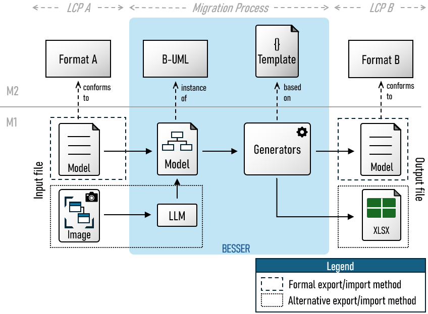

# BESSER-Migration-Hub

This repository host a solution based on [BESSER](https://github.com/BESSER-PEARL/BESSER.git) to improve the interoperability of Low Code Platforms (LCPs) by (semi)automatically migrating models specified in one platform to another one.

The following figure illustrates various pipelines for migrating models, depending on the LCP's export/import capabilities and supported data formats.

  

# Requirements

# License

This project is licensed under the [MIT](LICENSE) license.