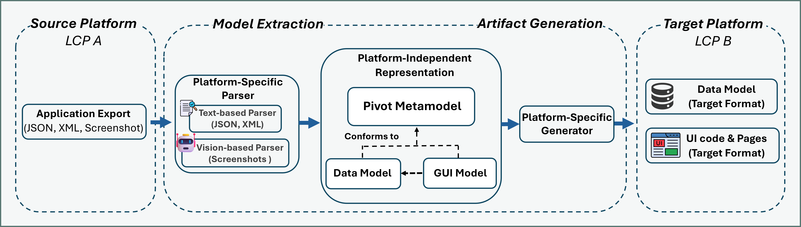

# A Model-Driven Interoperability Framework for Automated Migration Across Low-Code Platforms

This repository provides an open-source implementation of a **pivot-based, model-driven framework** for automated migration between heterogeneous Low-Code Platforms (LCPs), built on top of [BESSER](https://github.com/BESSER-PEARL/BESSER.git).

Low-code platforms accelerate enterprise application development through visual modeling and automated code generation. However, their proprietary modeling languages and restricted export/import mechanisms create **vendor lock-in**, making cross-platform migration expensive and error-prone. This framework addresses that gap by introducing a **platform-independent intermediate representation** (B-UML) that decouples source extraction from target generation — eliminating pairwise transformations and enabling reusable migration pipelines.

The migration process follows a two-phase strategy:
1. **Extraction** — application models (data model + GUI) are parsed from the source platform's export artifacts.
2. **Generation** — the intermediate B-UML model is transformed into executable artifacts for the target platform.

<div align="center">
  
</div>

---

## Supported Platforms

| Platform | Source (export) | Target (import) |
|---|---|---|
| **Mendix** | Data model + GUI | — |
| **Oracle APEX** | Data model + GUI | Data model + GUI |
| **Retool** | Data model + GUI | Data model + GUI |
| **ServiceNow** | — | Data model only |

### Supported Migration Paths

| Migration path | Data model | GUI |
|---|---|---|
| Mendix → Oracle APEX | ✅ | ✅ |
| Mendix → Retool | ✅ | ✅ |
| Oracle APEX → Retool | ✅ | ✅ |
| Retool → Oracle APEX | ✅ | ✅ |
| Mendix → ServiceNow | ✅ | — |

---

## Repository Structure

```
BESSER-Migration-Hub/
│
├── migrator/
│   ├── parsers/                    # Source platform parsers
│   │   ├── oracle_apex/            # Oracle APEX DDL + page parser
│   │   ├── retool/                 # Retool CSV + RSX parser
│   │   └── mendix/                 # Mendix JSON model + GUI parser
│   │
│   ├── generators/                 # Target platform generators
│   │   ├── retool/                 # Retool CSV + RSX app generator
│   │   ├── service_now/            # Generator for ServiceNow
│   │   └── sql/                    # Generators for Oracle APEX
│   │
│   └── converters/                 # Migration pipeline scripts
│
├── examples/
│   ├── mendix_to_oracle_apex/      # Library, Shopping, Hospital case studies
│   ├── mendix_to_powerapps/
│   └── powerapps_to_oracle_apex/
│
└── figs/                           # Framework diagrams and figures
```

---

## Getting Started

### Prerequisites

- Python 3.9+ (3.11 recommended)

### Installation

```bash
# Clone the repository
git clone https://github.com/your-org/BESSER-Migration-Hub.git
cd BESSER-Migration-Hub

# Create and activate a virtual environment
python -m venv .venv

# Windows
.\.venv\Scripts\activate
# macOS / Linux
source .venv/bin/activate

# Install dependencies
pip install -r requirements.txt
pip install besser
```

---

## Running a Migration (as an example)

### Simple runner scripts (recommended)

Each script has a configuration block at the top. Edit the input paths and run:

**Oracle APEX → Retool:**
```bash
# Edit DDL_PATH, PAGES_DIR, APP_NAME in the script, then:
python migrator/converters/apex_to_retool.py
```

**Retool → Oracle APEX:**
```bash
# Edit CSV_DIR, APEX_EXPORT_DIR, APP_NAME in the script, then:
python migrator/converters/retool_to_apex.py
```


## Examples

The `examples/` directory contains ready-to-run case studies:

| Example | Description |
|---|---|
| [`examples/mendix_to_oracle_apex/library`](examples/mendix_to_oracle_apex/library) | Library management system — Mendix → Oracle APEX |
| [`examples/mendix_to_oracle_apex/shopping`](examples/mendix_to_oracle_apex/shopping) | E-commerce application — Mendix → Oracle APEX |
| [`examples/mendix_to_oracle_apex/hospital`](examples/mendix_to_oracle_apex/hospital) | Hospital management system — Mendix → Oracle APEX |
| [`examples/mendix_to_powerapps`](examples/mendix_to_powerapps) | Mendix → Microsoft Power Apps |
| [`examples/powerapps_to_oracle_apex`](examples/powerapps_to_oracle_apex) | Power Apps → Oracle APEX |

Each example folder contains a `README.md` with the data model diagram, case study characteristics, and the generated output artifacts.

---

## License

This project is licensed under the [MIT](LICENSE) license.
