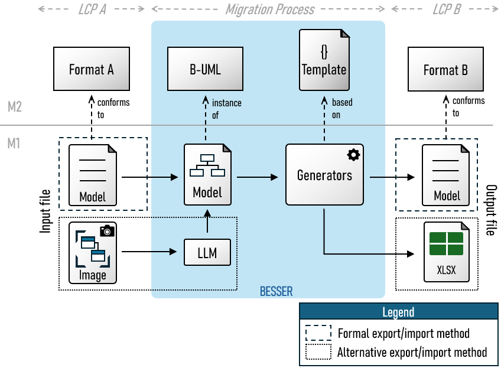

# BESSER-Migration-Hub

This repository host a solution based on [BESSER](https://github.com/BESSER-PEARL/BESSER.git) to improve the interoperability of Low Code Platforms (LCPs) by (semi)automatically migrating models specified in one platform to another one.

The following figure illustrates the migration pipelines supported by the framework, depending on the LCP export/import capabilities and supported formats, covering both structural (domain model) and GUI model migration.

<div align="center">
  
</div>

This project targets **Python 3.9+** (3.11 is recommended) and uses the
[BESSER](https://github.com/BESSER-PEARL/BESSER.git) library to perform
model migrations between low‑code platforms.

### Getting started

```bash
# clone the repo
git clone https://github.com/your-org/BESSER-Migration-Hub.git
cd BESSER-Migration-Hub

# create and activate a virtual environment (example uses venv)
python -m venv .venv
# Windows
.\.venv\Scripts\activate
# macOS/Linux
source .venv/bin/activate

# install runtime dependencies
pip install -r requirements.txt

# install BESSER
pip install besser
```

After installing, you can run one of the example converters such as
`migrator/converters/mendix_to_apex.py` or explore the `migrator`/`examples`
folders.

Refer to the `examples` directory for sample input files and usage
scenarios.


# License

This project is licensed under the [MIT](LICENSE) license.