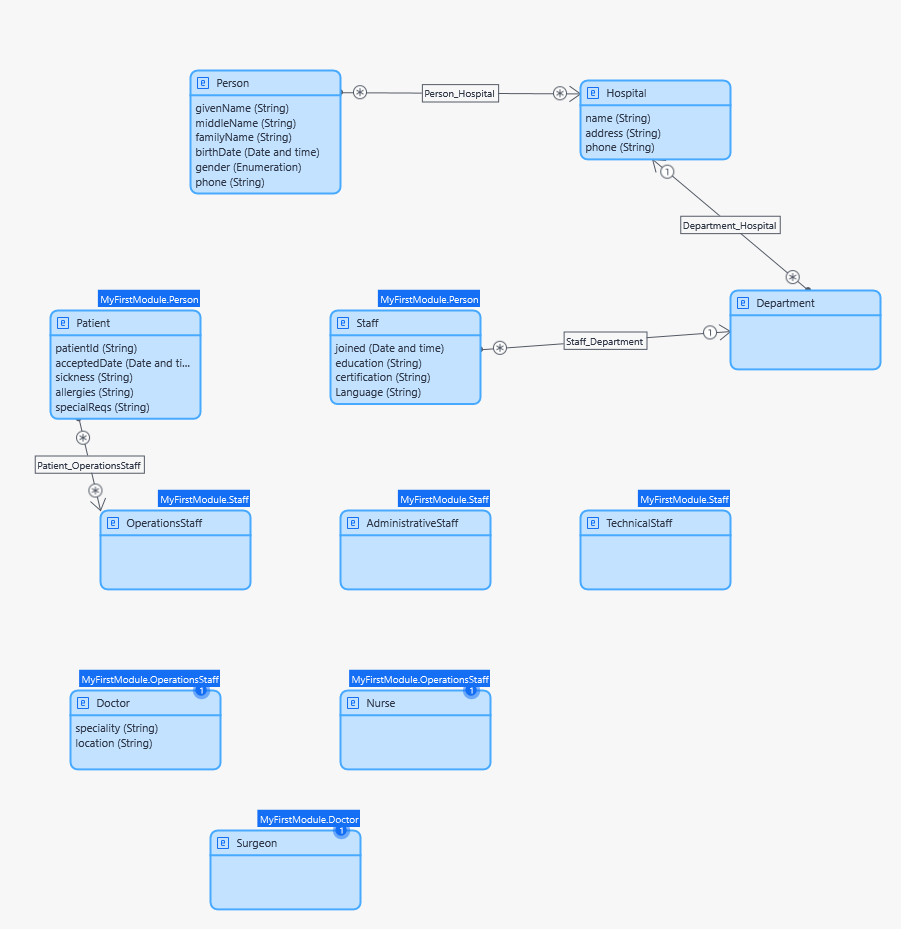

# Example: Mendix → Oracle APEX — Hospital

This example demonstrates the migration of a **Hospital management system** from Mendix to Oracle APEX using the BESSER Migration Hub framework.

## Data Model

The diagram below shows the original data model as defined in Mendix:

  

## Case Study Characteristics

| Metric | Value |
|---|---|
| Entity classes | 11 |
| Attributes | 20 |
| Associations | 4 |
| Enumerations (literals) | 1 (3) |
| Generalizations | 8 |
| GUI screens | 11 |
| GUI widgets | 110 |

## Input

| File | Description |
|---|---|
| `model.json` | Mendix application model exported as JSON |

## Output

The `output/` folder contains the generated Oracle APEX artifacts:

| File | Description |
|---|---|
| `generated_script_oracle_apex.sql` | DDL script — CREATE TABLE statements for all entities |
| `Hospital_page_generated.sql` | APEX interactive report page for the Hospital entity |
| `Department_page_generated.sql` | APEX interactive report page for the Department entity |
| `Person_Page_generated.sql` | APEX interactive report page for the Person entity |
| `Patient_page_generated.sql` | APEX interactive report page for the Patient entity |
| `Staff_page_generated.sql` | APEX interactive report page for the Staff entity |

## How to Import into Oracle APEX

1. Run `generated_script_oracle_apex.sql` against your Oracle schema to create the tables.
2. Create a new blank APEX application.
3. Import each `*_page_generated.sql` file via **SQL Workshop → SQL Scripts → Run**.
