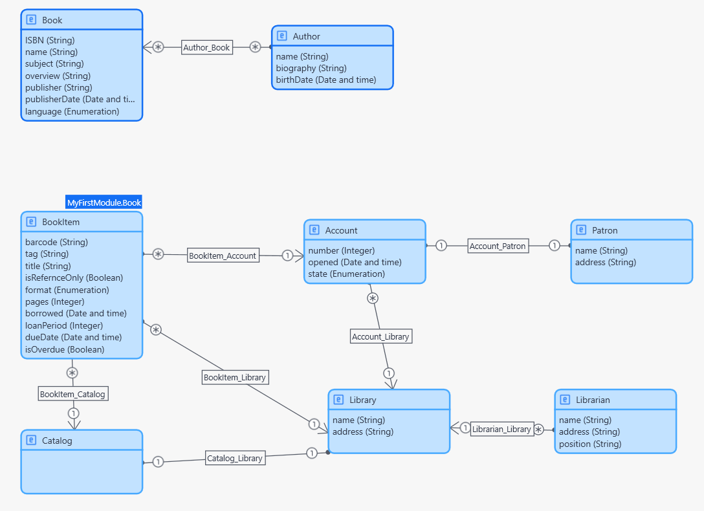

# Example: Mendix → Oracle APEX — Library

This example demonstrates the migration of a **Library management system** from Mendix to Oracle APEX using the BESSER Migration Hub framework.

## Data Model

The diagram below shows the original data model as defined in Mendix:

  

## Case Study Characteristics

| Metric | Value |
|---|---|
| Entity classes | 8 |
| Attributes | 30 |
| Associations | 8 |
| Enumerations (literals) | 3 (14) |
| Generalizations | 1 |
| GUI screens | 8 |
| GUI widgets | 80 |

## Input

| File | Description |
|---|---|
| `model.json` | Mendix application model exported as JSON |

## Output

The `output/` folder contains the generated Oracle APEX artifacts:

| File | Description |
|---|---|
| `generated_script_oracle_apex.sql` | DDL script — CREATE TABLE statements for all entities |
| `Author_page_generated.sql` | APEX interactive report page for the Author entity |
| `BookItem_page_generated.sql` | APEX interactive report page for the BookItem entity |
| `Library_page_generated.sql` | APEX interactive report page for the Library entity |
| `Patron_page_generated.sql` | APEX interactive report page for the Patron entity |
| `Account_page_generated.sql` | APEX interactive report page for the Account entity |
| `Catalog_page_generated.sql` | APEX interactive report page for the Catalog entity |
| `Librarian_page_generated.sql` | APEX interactive report page for the Librarian entity |

## How to Import into Oracle APEX

1. Run `generated_script_oracle_apex.sql` against your Oracle schema to create the tables.
2. Create a new blank APEX application.
3. Import each `*_page_generated.sql` file.
