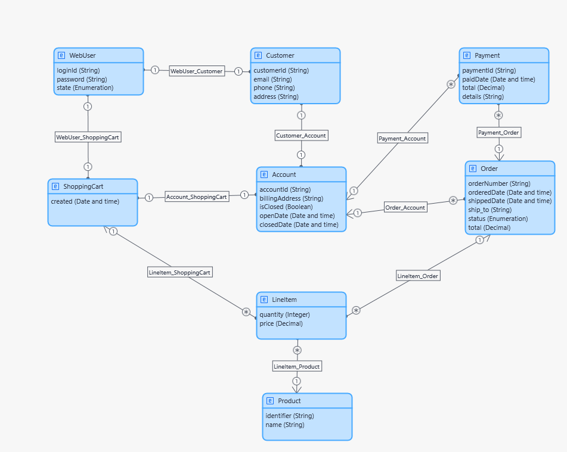

# Example: Mendix → Oracle APEX — Shopping

This example demonstrates the migration of an **E-commerce (Shopping) application** from Mendix to Oracle APEX using the BESSER Migration Hub framework.

## Data Model

The diagram below shows the original data model as defined in Mendix:

<div align="center">
  
</div>

## Case Study Characteristics

| Metric | Value |
|---|---|
| Entity classes | 8 |
| Attributes | 27 |
| Associations | 10 |
| Enumerations (literals) | 2 (9) |
| Generalizations | 0 |
| GUI screens | 8 |
| GUI widgets | 80 |

## Input

| File | Description |
|---|---|
| `model.json` | Mendix application model exported as JSON |

## Output

The `output/` folder contains the generated Oracle APEX artifacts:

| File | Description |
|---|---|
| `generated_script_oracle_apex.sql` | DDL script — CREATE TABLE statements for all entities |
| `Product_page_generated.sql` | APEX interactive report page for the Product entity |
| `WebUser_page_generated.sql` | APEX interactive report page for the WebUser entity |
| `Customer_page_generated.sql` | APEX interactive report page for the Customer entity |
| `ShoppingCart_page_generated.sql` | APEX interactive report page for the ShoppingCart entity |
| `Account_page_generated.sql` | APEX interactive report page for the Account entity |
| `LineItem_page_generated.sql` | APEX interactive report page for the LineItem entity |
| `Payment_page_generated.sql` | APEX interactive report page for the Payment entity |

## How to Run

From the repository root:

```bash
python migrator/converters/mendix_to_apex.py \
  --model examples/mendix_to_oracle_apex/shopping/model.json \
  --module MyFirstModule \
  --output examples/mendix_to_oracle_apex/shopping/output
```

## How to Import into Oracle APEX

1. Run `generated_script_oracle_apex.sql` against your Oracle schema to create the tables.
2. Create a new blank APEX application.
3. Import each `*_page_generated.sql` file via **SQL Workshop → SQL Scripts → Run**.
