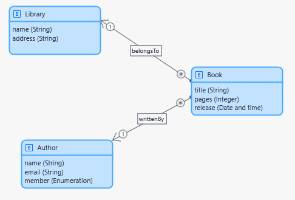
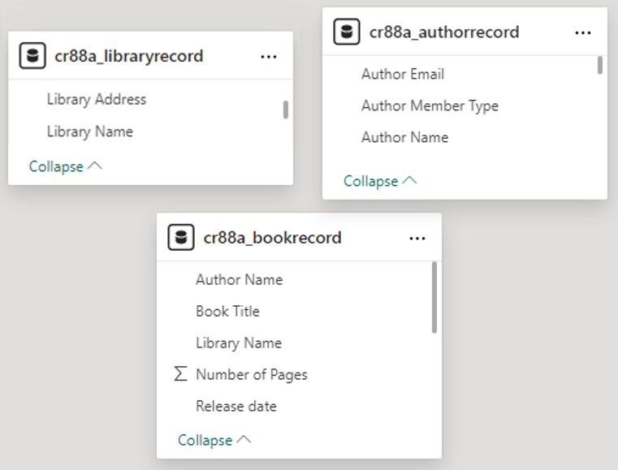

# Migrating a data model from Mendix to PowerApps

This is an example of migrating a simple library data model designed in Mendix:

<div align="center">
  
</div>

Using the [MPR Dump feature of Mendix](https://docs.mendix.com/refguide/mx-command-line-tool/dump-mpr/), export your project in JSON format.

Then, transform the data model using the JSON file into a B-UML model as shown below.

```python
from besser.BUML.metamodel.structural import DomainModel
from migrator import ModelMigrator

# Parse json Mendix model to B-UML model
model_migrator: ModelMigrator  = ModelMigrator(lcp="mendix", 
                                            model_path="library.json", 
                                            module_name="MyFirstModule")
buml_model: DomainModel = model_migrator.domain_model()
```

Where `model_path` is the path of the JSON file, `module_name` the name of the module containing the domain model, and `buml_model` is the B-UML model obtained.

If you need the Python base code for your B-UML model, for example, to modify or complete the data model, you can use this function:

```python
from besser.utilities import buml_code_builder

buml_code_builder.domain_model_to_code(model=buml_model, file_path="output/buml_model.py")
```

The file [output/buml_model.py](output/buml_model.py) will be generated, containing the code to define the model in B-UML.

Now that we have the B-UML model, we can use a generator to transform it and obtain the data model for importing into another LCP. For example, let's use the spreadsheet generator.

```python
from migrator.generators.spreadsheet import SpreadSheetGenerator

# Generate Spreadsheet
generator = SpreadSheetGenerator(model=buml_model)
generator.generate()
```

The [model.xlsx](output/model.xlsx) should be generated. You can check the complete code for this example in the [migrate.py](migrate.py) script.

This spreadsheet can be imported into other LCPs, such as PowerApps, to generate a data model as shown below. Note that the model lacks associations, which must be manually added by the user.

<div align="center">
  
</div>