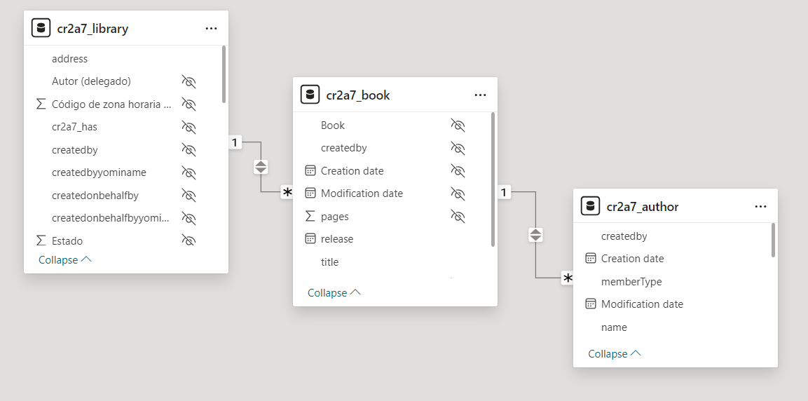
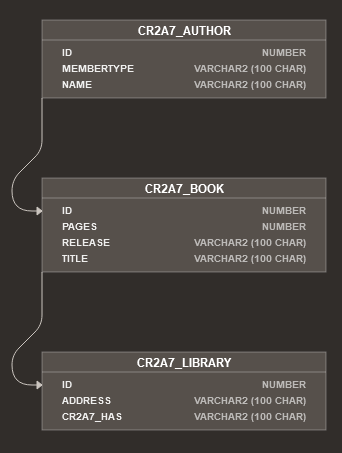

# Migrating a data model from Mendix to PowerApps

This is an example of migrating a simple library data model designed in PowerApps:

<div align="center">
  
</div>

Additionally, we exported the individual tables as CSV files using PowerApps' export functionalities. 

Then, transform the data model using the image and the csv files into a B-UML model as shown below.

```python
from besser.BUML.metamodel.structural import DomainModel
from migrator import ModelMigrator

# Parse json Mendix model to B-UML model
import configparser

from besser.BUML.metamodel.structural import DomainModel
from besser.utilities import buml_code_builder
from besser.generators.sql.sql_generator import SQLGenerator
from migrator import ModelMigrator

# Load configuration
config = configparser.ConfigParser()
config.read('config.ini')

# Access the token
openai_token = config['DEFAULT']['OPENAI_TOKEN']


# Parse screenshot of PowerApps model with csv files of tables to B-UML model
model_migrator: ModelMigrator  = ModelMigrator(lcp="powerapps", 
                                            model_path="library.png",
                                            module_name=["author.csv", "book.csv", "library.csv"],
                                            openai_token = openai_token
                                            )
buml_model: DomainModel = model_migrator.domain_model()
```

Where `image_path` is the path of the JSON file, `module_name` is a list of paths to the exported CSV files, and `buml_model` is the B-UML model obtained.

If you need the Python base code for your B-UML model, for example, to modify or complete the data model, you can use this function:

```python
from besser.utilities import buml_code_builder

buml_code_builder.domain_model_to_code(model=buml_model, file_path="output/buml_model.py")
```

The file [output/buml_model.py](output/buml_model.py) will be generated, containing the code to define the model in B-UML.

Now that we have the B-UML model, we can use a generator to transform it and obtain the data model for importing into another LCP. For example, let's use the SQL generator and choose "oracle" as the sql_dialect.

```python
from besser.generators.sql.sql_generator import SQLGenerator

# Generate the Oracle SQL code
generator = SQLGenerator(model=buml_model, sql_dialect="oracle")
generator.generate()
```

The [tables.sql](output/tables.sql) should be generated. You can check the complete code for this example in the [migrate.py](migrate.py) script.

This SQL file with the oracle dialect can be imported into Oracle Apex to generate a data model as shown below.

<div align="center">
  
</div>